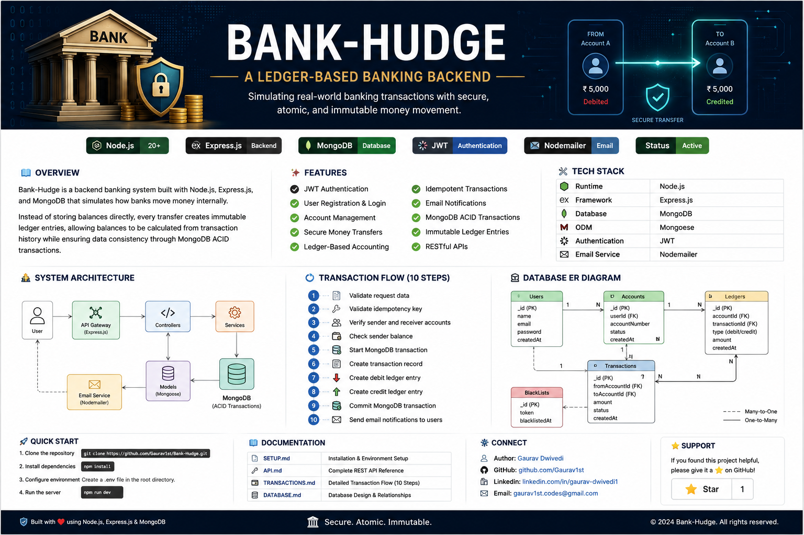

# 🏦 Bank-Hudge

<p align="center">
  
</p>

<p align="center">
  <strong>A Ledger-Based Banking Backend</strong><br>
  Simulating real-world banking transactions with secure, atomic, and immutable money movement.
</p>

<p align="center">


</p>

---

# 📖 Overview

**Bank-Hudge** is a backend banking application built with **Node.js**, **Express.js**, and **MongoDB** that simulates real-world banking operations using a **ledger-based accounting system**.

Instead of storing balances directly, every transaction creates immutable ledger entries. Account balances are calculated from these entries, ensuring consistency, traceability, and transactional integrity.

---

# ✨ Features

- 🔐 JWT Authentication
- 👤 User Registration & Login
- 🏦 Bank Account Management
- 💸 Secure Money Transfers
- 📒 Ledger-Based Accounting
- 🔄 Idempotent Transactions
- 🛡️ MongoDB ACID Transactions
- 📧 Email Notifications
- 🚫 Token Blacklisting
- ⚡ RESTful APIs

---

# 🛠️ Tech Stack

| Category | Technology |
|-----------|------------|
| Runtime | Node.js |
| Framework | Express.js |
| Database | MongoDB |
| ODM | Mongoose |
| Authentication | JWT |
| Email Service | Nodemailer |

---

# 📂 Project Structure

```text
Bank-Hudge/
│
├── docs/
│   ├── API.md
│   ├── DATABASE.md
│   ├── SETUP.md
│   └── TRANSACTIONS.md
│
├── src/
│   ├── controllers/
│   ├── middlewares/
│   ├── models/
│   ├── routes/
│   ├── services/
│   └── utils/
│
├── .gitignore
├── package.json
├── server.js
└── README.md
```

---

# 🚀 Getting Started

### Clone Repository

```bash
git clone https://github.com/Gaurav1st/Bank-Hudge.git
```

### Install Dependencies

```bash
npm install
```

### Create Environment File

```env
PORT=3000

MONGODB_URI=

JWT_SECRET=

EMAIL=

EMAIL_PASSWORD=
```

### Run Development Server

```bash
npm run dev
```

---

# 📚 Documentation

| Document | Description |
|----------|-------------|
| 📘 [Setup Guide](docs/SETUP.md) | Installation & Environment Setup |
| 🔌 [API Documentation](docs/API.md) | REST API Reference |
| 💳 [Transaction Flow](docs/TRANSACTIONS.md) | 10-Step Transaction Lifecycle |
| 🗄️ [Database Design](docs/DATABASE.md) | Collections & Relationships |

---

# 🔒 Core Banking Concepts

- Ledger-Based Accounting
- Immutable Ledger Entries
- MongoDB Transactions
- JWT Authentication
- Idempotency Keys

---

# 🔄 Transaction Flow

```text
User
 │
 ▼
Authenticate
 │
 ▼
Validate Accounts
 │
 ▼
Check Balance
 │
 ▼
Create Transaction
 │
 ▼
Create Debit Ledger
 │
 ▼
Create Credit Ledger
 │
 ▼
Commit MongoDB Transaction
 │
 ▼
Send Email Notification
```

---

# 📌 Modules

- ✅ Authentication
- ✅ Accounts
- ✅ Transactions
- ✅ Ledger
- ✅ Email Service
- ✅ Blacklisted Tokens

---

# 🤝 Contributing

Contributions are welcome.

1. Fork the repository
2. Create your feature branch
3. Commit your changes
4. Push the branch
5. Open a Pull Request

---

# 👨‍💻 Author

**Gaurav Dwivedi**

- GitHub: https://github.com/Gaurav1st

---

# ⭐ Support

If you found this project helpful, consider giving it a ⭐ on GitHub.